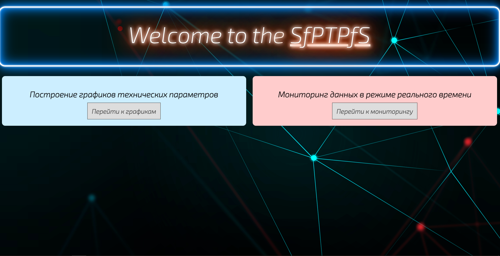
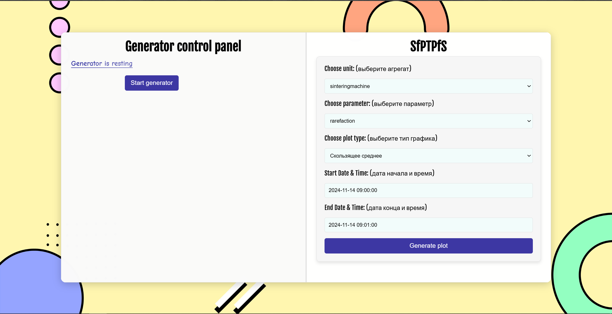

   <h1 align="center"> SfPTPfS: <i>Service for Plotting Technical Parameters from Sensors</i> </h1>

### _Интересный факт_ 
> Название _"SfPTPfS"_ представляет собой **палиндром,** то есть слово, которое читается **одинаково** слева направо и справа налево, учитывая размеры букв. 
<br> Оно было придумано абсолютно случайно путём перевода названия _"сервис для построения графиков технических параметров с датчиков"_ на английский.
- - - - - - - - - - - -
 # Оглавление

- [📖 Описание](#описание)
- [🛠️ Установка и запуск](#установка-и-запуск)
    - [🔹 Установка с помощью Docker](#установка-с-помощью-docker)
    - [🔶 Установка с помощью Git](#установка-с-помощью-git)
- [🚀 Как пользоваться](#как-пользоваться)
- [📚 Перед началом работы](#перед-началом-работы)


<a id="описание"></a>
  # 📖 Описание
_SfPTPfS_ предназначен для специалистов, которые взаимодействуют с агрегатами на производстве. 
<br> Работа предполагается в двух режимах:  
1. **Оффлайн-режим** — позволяет строить различные графики параметров агрегатов на основе данных из базы.  
2. **Онлайн-режим** — позволяет отслеживать изменение параметров в реальном времени.


<a id="установка-и-запуск"></a>
  # 🛠️ Установка и запуск
У вас есть два варианта: 
1. **Лёгкий способ** — использовать Docker. 
2. **Сложный способ** — развернуть проект из исходников вручную.
> В любом случае, проект нужно сначала клонировать с GitHub.

<a id="установка-с-помощью-docker"></a>
 ## 🔹 I. Установка с помощью Docker _(лёгкий способ)_
Этот способ самый быстрый и простой, т.к. все настройки и зависимости уже упакованы в контейнеры.

### 1. Клонирование репозитория  
  ```bash
  git clone --filter=blob:none --sparse https://github.com/RaptorT1V/SfPTPfS
  cd SfPTPfS
  git sparse-checkout set --exclude=mobile
  ```

### 2. Сборка контейнеров
  ```bash
  cd docker
  docker-compose up --build
  ```

### 3. Запуск проекта
  ```bash
  docker-compose up -d
  ```
> http://127.0.0.1:8000

<a id="установка-с-помощью-git"></a>
 ## 🔶 II. Установка с помощью Git _(сложный способ)_
Этот способ потребует больше времени, но зато даст вам полный контроль над кодом проекта.

### 1. Клонирование репозитория  
- Если нужен **полный проект** _(включая mobile),_ выполните команду:  
  ```bash
  git clone https://github.com/RaptorT1V/SfPTPfS
  ```
- Если директория **mobile не нужна,** выполните команды:
  ```bash
  git clone --filter=blob:none --sparse https://github.com/RaptorT1V/SfPTPfS
  cd SfPTPfS
  git sparse-checkout set --exclude=mobile
  ```

### 2. Подготовка базы данных

#### 2.1. Установите PostgreSQL версии 16.1 или выше
Вы можете ставить его на основную OC Windows **либо**, как я, использовать виртуальную машину с Ubuntu _(или другой Linux-подобной ОС)_. 
<br> Но в таком случае придётся лезть в файлы, настраивать порты, и ещё всякое _(я давно это настроил и уже не помню, что конкретно делал; смотрите соответствующие туториалы на YouTube)_...

#### 2.2. Создайте базу данных (через psql или pgAdmin)
- [ ] Через консоль **psql**

a) Создание базы данных
```bash 
sudo -u postgres psql
CREATE DATABASE diagnostics_db
/q
```

б) Инициализация базы данных одним из скриптов в backend/db
  - database.sql — чистая база без данных _(заполнится с помощью запуска генератора)_;
  - diagnostics_db.sql — дамп базы данных с данными за 14 ноября 2024 года с 9:00 до 11:00.
```bash
psql -U postgres -d diagnostics_db -f path/to/backend/db/diagnostics_db.sql
```

- [x] Через **pgAdmin** 
<br> Тут всё очень просто: создаёте сервер, создаёте базу данных, создаёте скрипт, вставляете туда содержимое одного из скриптов в backend/db, приведённых выше, и запускаете его.

### 3. Настройка проекта

#### 3.1. Перейдите в папку backend и отредактируйте файл settings.py
  - Удалите строки, которые не закомментированы.
  - Раскомментируйте строки с настройками для локальной разработки.

#### 3.2. Установите зависимости из файла requirements.txt
```bash
pip install -r requirements.txt
```

### 4. Запуск проекта

#### 4.1. Перейдите в папку backend и выполните команду
```python
python backend/app.py
```

#### 4.2. Откройте браузер и перейдите по адресу
http://127.0.0.1:8000


<a id="как-пользоваться"></a>
  # 🚀 Как пользоваться

## 1. Оффлайн-плоттинг _(левая страница)_

#### 1. Выберите агрегат и соответствующий параметр
#### 2. Выберите тип графика
#### 3. Выберите временной промежуток для построения графика
- Если вы использовали дамп базы данных `diagnostics.db`, данные доступны за 14 ноября 2024 года _(с 9:00 до 11:00)_.
- Если вы использовали файл `database.db` и база данных пустая, нажмите на кнопку "Start Generator", чтобы сгенерировать данные.
> **Примечание:** время в базе данных может не совпадать с реальным из-за отсутствия привязки к часовому поясу.
#### 4. Нажмите на кнопку "Generate graph"
> **Примечание:** файлы графиков хранятся в папке backend/graphics.



## 2. Онлайн-мониторинг _(правая страница)_

#### 1. Запустите генератор _(левая страница)_
#### 2. Вернитесь на стартовую страницу _(через кнопки в браузере "вперёд" / "назад")_ и перейдите на правую страницу
#### 3. Выберите агрегат и соответствующий параметр
#### 4. Масштабируйте и панорамируйте график колёсиком мыши
> **Примечание:** фон страницы может отображаться некорректно из-за масштабирования. Используйте настройку масштаба браузера (рекомендуется от 70% до 110%).


- - - - - - - - - - - -

<a id="перед-началом-работы"></a>
  # 📚 Перед началом работы _(полезные файлы)_
  
#### 1. [Структура проекта](Структура%20проекта.txt)
Нужен для понимания, как устроен проект, что за что отвечает.

#### 2. [Про типы графиков в программе](Про%20типы%20графиков%20в%20программе.md)
Нужен для понимания, зачем строятся те или иные графики.

#### 3. [Планы на следующие обновления и нереализованные идеи](Планы%20на%20следующие%20обновления%20и%20нереализованные%20идеи.md)
Нужен, чтобы узнать о будущих нововведениях и нереализованных функциях.
